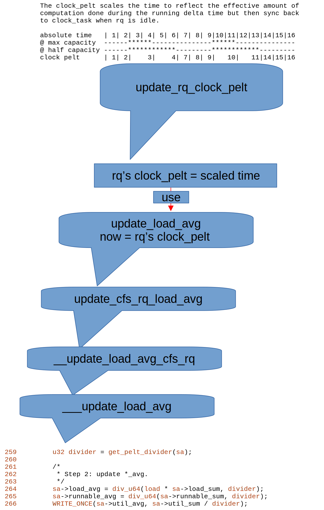
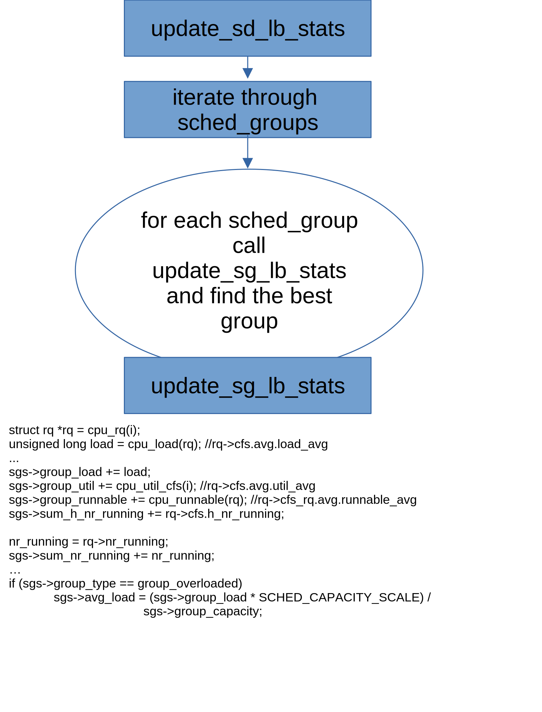

# I-Learn-Completely-Fair-Scheduling
The Complete Fair Scheduler (CFS) is the default process scheduler for the Linux kernel, designed to provide fair CPU time to processes while maintaining good overall system performance. It got further complicated by introducing of Group scheduling enhancements. So I learn CFS in a top-down manner.

## 1. CFS with Group scheduling enhancements
When Linux's core scheduler wants to pick next task from CFS, pick_next_task_fair will be called.


As illustrated by above figure, pick_next_task_fair begin with CPU's runqueue's
cfs_rq, then in a while loop, pick_next_entity is called to select best se from cfs_rq, and continue with cfs_rq of the selected se.

## 2. vruntime and lag and deadline

### 2.1 vruntime
vruntime is a per-process counter that tracks the amount of CPU time a process has received, adjusted for its priority.

CFS maintains a red-black tree, which is a self-balancing binary search tree, to manage tasks in the run queue. Each node in this tree represents a process, and the tree is sorted by vruntime.
The leftmost node in the red-black tree (the process with the smallest vruntime) is always selected for execution next.

Processes with lower priority (higher nice values) will have their vruntime increase faster, meaning they will get less CPU time.
Conversely, higher-priority processes (lower nice values) have their vruntime increase slower, allowing them to run longer on the CPU before being preempted.

### 2.2 lag
In the context of the Completely Fair Scheduler (CFS), lag generally refers to the delay or deviation in how fairly the CPU time is distributed among processes. Since CFS aims to distribute CPU time as fairly as possible, any "lag" would indicate a situation where this fairness is not perfectly achieved.

In CFS, lag is computed as:
```
lag = avg_vruntime(cfs_rq) - se->vruntime;
```
which means the difference between cfs_rq's average runtime and the process's runtime

### 2.3 deadline
In the context of the Completely Fair Scheduler (CFS), "deadline" isn't a concept that directly applies as it might in real-time scheduling or the Deadline scheduler (a different Linux scheduler). However, the term might come up in discussions about how CFS indirectly handles task prioritization and scheduling latency.

In function pick_eevdf,  kernel travel from the root of cfs_rq's red-black tree in a top down manner. As is illustrated in .

1. firstly if current node is not eligible, let node = node->rb_left, continue.

2. if current node has the smallest deadline, select current node and break.

3. if left child's sub tree has the smallest deadline, let node = node->rb_left, continue.

4. let node = node->rb_right, continue.


## 3. load balance

In a multi-processor system, load balancing is crucial to ensure that CPU resources are utilized efficiently.
CFS performs load balancing by migrating tasks between CPUs to avoid CPU overload and to maintain fairness across all CPUs.

Load balancing in CFS happens periodically, or when specific events trigger it (e.g., a task waking up, task creation, etc.).


As is illustrated in above figure, when picking next task in CFS, and found current rq is idle, then use
load_balance to find busiest CPU sched group from current domain hiearchy, then find the busiest queue from that sched group.

## 4. Idle CPU Scan
One of the key decisions the CFS scheduler makes is determining which CPU to run a new or migrated task on, particularly in systems with multiple CPUs or cores. Selecting the most "idle" CPU can help balance the load across the system, improving overall performance and efficiency.


Idle CPU Scan is done in function select_idle_cpu. select_idle_cpu try cpu one by one in a loop to find a cpu that is idle (by calling __select_idle_cpu).

Further, Intel developer has found that when the ystem is overloaded, select_idle_cpu() might spend too much time searching for an idle CPU[1]. So, [1] summarize that the lower the util_avg is, the more select_idle_cpu()
should scan for idle CPU, and vice versa. When the sum of util_avg
in this LLC domain hits 85% or above, the scan stops. [1] introduce a quadratic function:

y = SCHED_CAPACITY_SCALE - p * x^2
and y'= y / SCHED_CAPACITY_SCALE

nr_scan = llc_weight * y'

Where x is the ratio of sum_util compared to the CPU capacity.

According to [1], choosing quadratic function is because:

[1] Compared to the linear function, it scans more aggressively when the
    sum_util is low.
    
[2] Compared to the exponential function, it is easier to calculate.

[3] It seems that there is no accurate mapping between the sum of util_avg
    and the number of CPUs to be scanned. Use heuristic scan for now.

## 5. PELT Clock
The PELT Clock is introduced because of CPU capacity [2]. According to [2], some CPU has more
capacity than other CPU. In Example 2 of [2], capacities-dmips-mhz are scaled w.r.t. 2 (cpu@0 and cpu@1),
this means that first cpu@0 and cpu@1 are twice fast than cpu@2 and cpu@3 (at the same frequency).

When a rq runs at a lower compute capacity, it will need
 more time to do the same amount of work than at max
capacity. In order to be invariant, we scale the delta to
reflect how much work has been really done.

We can see that when computing load average of a cfs_rq, cfs_rq_clock_pelt is used as the time.



In function update_sg_lb_stats, sgs->avg_load is computed as
```
9688         if (sgs->group_type == group_overloaded)
9689                 sgs->avg_load = (sgs->group_load * SCHED_CAPACITY_SCALE) /
9690                                 sgs->group_capacity;
```

The caller of update_sg_lb_stats: update_sd_lb_stats iterate through the candidate sched_groups
to find best sched_group, when the sched_group's group_type is group_overloaded sgs->avg_load
is the influence factor.



## 6. min_vruntime

According to [3], "CFS also maintains the rq->cfs.min_vruntime value, which is a monotonic increasing value tracking the smallest vruntime among all tasks in the runqueue. The total amount of work done by the system is tracked using min_vruntime; that value is used to place newly activated entities on the left side of the tree as much as possible."

## 7. Other details

### 7.1 runnable_avg_yN_inv
The Linux kernel compute yN_inv as x = ((1UL<<32)-1)*pow(y, i), this is because y=0.97857206208770009 and there is
no float support in kernel, so we first comput result = val*((1UL<<32)-1)*pow(y, i), then compute result/(1UL<<32)

### 7.2 Per Entity Load Tracking
According to [4], quote:

Per-entity load tracking addresses these problems by pushing this tracking down to the level of individual "scheduling entities" — a process or a control group full of processes. To that end, (wall clock) time is viewed as a sequence of 1ms (actually, 1024µs) periods. An entity's contribution to the system load in a period pi is just the portion of that period that the entity was runnable — either actually running, or waiting for an available CPU. The trick, though, is to get an idea of contributed load that covers more than 1ms of real time; this is managed by adding in a decayed version of the entity's previous contribution to system load. If we let Li designate the entity's load contribution in period pi, then an entity's total contribution can be expressed as:

```
L = L0 + L1*y + L2*y^2 + L3*y^3 + ...
```
In the current code, y has been chosen so that y^32 is equal to 0.5, though, of course, the calculation is done with integer arithmetic in the kernel (as detailed in 7.1). Thus, an entity's load contribution 32ms in the past is weighted half as strongly as its current contribution.

For example, in function accumulate_sum, the input argument delta is the time passed in us, the degeneration rate is computed
in 1024us base. As illustrated in head comment of this function:

```
/*                                                                              
 * Accumulate the three separate parts of the sum; d1 the remainder             
 * of the last (incomplete) period, d2 the span of full periods and d3          
 * the remainder of the (incomplete) current period.                            
 *                                                                              
 *           d1          d2           d3                                        
 *           ^           ^            ^                                         
 *           |           |            |                                         
 *         |<->|<----------------->|<--->|                                      
 * ... |---x---|------| ... |------|-----x (now)
 *                                                                                                                               
 *                           p-1 
 * u' = (u + d1) y^p + 1024 \Sum y^n + d3 y^0
 *                           n=1                                                                                                 
 *
 *    = u y^p +                                 (Step 1)
 *                                                                                                                               
 *                     p-1                              
 *      d1 y^p + 1024 \Sum y^n + d3 y^0         (Step 2)
 *                     n=1
 ```
For example, given sa->period_contrib==589, delta==799, weight==91833, we have:

d1==1024-589,  periods==589+799/1024==1, d3==(589+799)%1024==364

```
 *           d1   d3                                        
 *           ^    ^                                         
 *           |    |                                         
 *         |<->|<--->|                                      
 * ... |---x---|-----x (now)
```


## 8. References

[1] [PATCH v4] sched/fair: Introduce SIS_UTIL to search idle CPU based on sum of util_avg https://lore.kernel.org/all/20220612163428.849378-1-yu.c.chen@intel.com/
[2] https://www.kernel.org/doc/Documentation/devicetree/bindings/arm/cpu-capacity.txt
[3] https://docs.kernel.org/scheduler/sched-design-CFS.html
[4] https://lwn.net/Articles/531853/