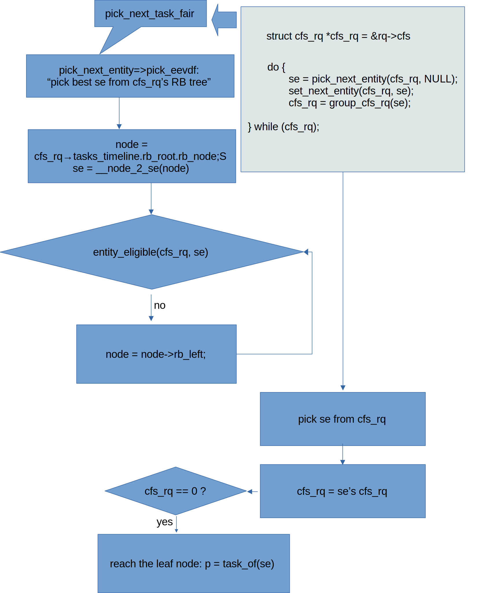
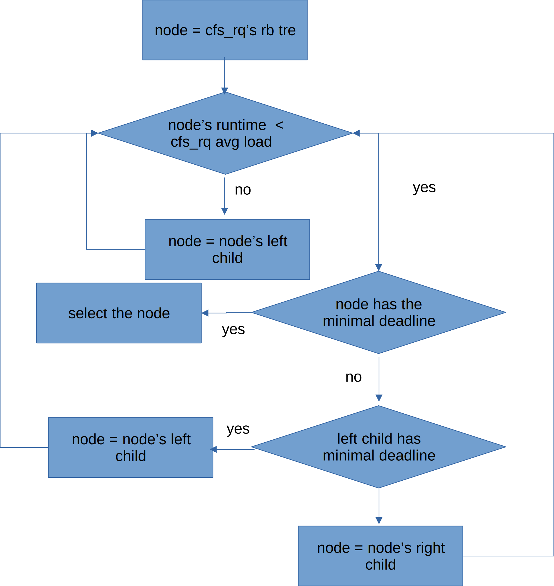
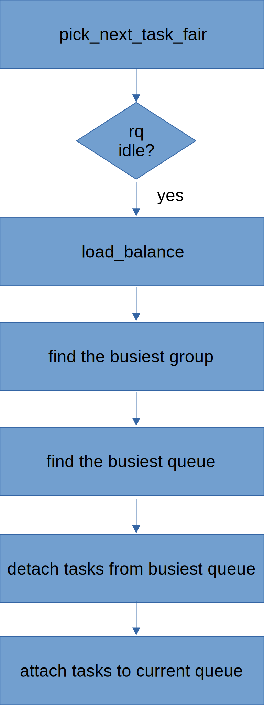

# I-Learn-Completely-Fair-Scheduling
The Complete Fair Scheduler (CFS) is the default process scheduler for the Linux kernel, designed to provide fair CPU time to processes while maintaining good overall system performance. It got further complicated by introducing of Group scheduling enhancements. So I learn CFS in a top-down manner.

## 1. CFS with Group scheduling enhancements
When Linux's core scheduler wants to pick next task from CFS, pick_next_task_fair will be called.


As illustrated by above figure, pick_next_task_fair begin with CPU's runqueue's
cfs_rq, then in a while loop, pick_next_entity is called to select best se from cfs_rq, and continue with cfs_rq of the selected se.

## 2. vruntime and lag and deadline

### 2.1 vruntime
vruntime is a per-process counter that tracks the amount of CPU time a process has received, adjusted for its priority.

CFS maintains a red-black tree, which is a self-balancing binary search tree, to manage tasks in the run queue. Each node in this tree represents a process, and the tree is sorted by vruntime.
The leftmost node in the red-black tree (the process with the smallest vruntime) is always selected for execution next.

Processes with lower priority (higher nice values) will have their vruntime increase faster, meaning they will get less CPU time.
Conversely, higher-priority processes (lower nice values) have their vruntime increase slower, allowing them to run longer on the CPU before being preempted.

### 2.2 lag
In the context of the Completely Fair Scheduler (CFS), lag generally refers to the delay or deviation in how fairly the CPU time is distributed among processes. Since CFS aims to distribute CPU time as fairly as possible, any "lag" would indicate a situation where this fairness is not perfectly achieved.

In CFS, lag is computed as:
```
lag = avg_vruntime(cfs_rq) - se->vruntime;
```
which means the difference between cfs_rq's average runtime and the process's runtime

### 2.3 deadline
In the context of the Completely Fair Scheduler (CFS), "deadline" isn't a concept that directly applies as it might in real-time scheduling or the Deadline scheduler (a different Linux scheduler). However, the term might come up in discussions about how CFS indirectly handles task prioritization and scheduling latency.

In function pick_eevdf,  kernel travel from the root of cfs_rq's red-black tree in a top down manner. As is illustrated in .

1. firstly if current node is not eligible, let node = node->rb_left, continue.

2. if current node has the smallest deadline, select current node and break.

3. if left child's sub tree has the smallest deadline, let node = node->rb_left, continue.

4. let node = node->rb_right, continue.


## 3. load balance

In a multi-processor system, load balancing is crucial to ensure that CPU resources are utilized efficiently.
CFS performs load balancing by migrating tasks between CPUs to avoid CPU overload and to maintain fairness across all CPUs.

Load balancing in CFS happens periodically, or when specific events trigger it (e.g., a task waking up, task creation, etc.).


As is illustrated in , when picking next task in CFS, and found current rq is idle, then use
load_balance to find busiest CPU sched group from current domain hiearchy, then find the busiest queue from that sched group.
