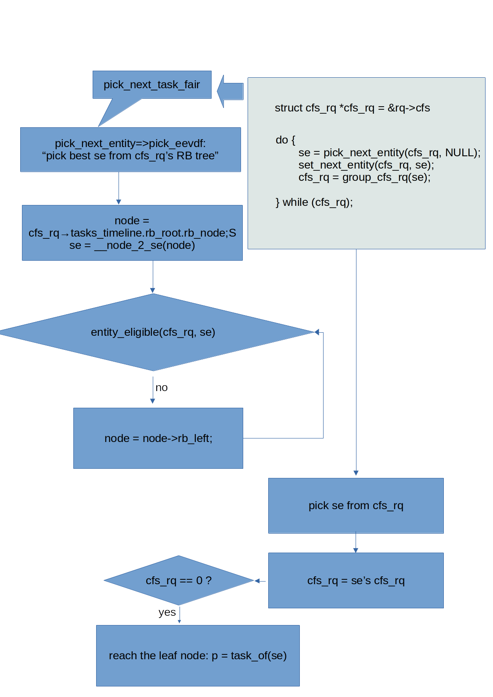

# I-Learn-Completely-Fair-Scheduling
The Complete Fair Scheduler (CFS) is the default process scheduler for the Linux kernel, designed to provide fair CPU time to processes while maintaining good overall system performance. It got further complicated by introducing of Group scheduling enhancements. So I learn CFS in a top-down manner.

## CFS with Group scheduling enhancements
When Linux's core scheduler wants to pick next task from CFS, pick_next_task_fair will be called.

As illustrated by above figure, pick_next_task_fair begin with CPU's runqueue's
cfs_rq, then in a while loop, pick_next_entity is called to select best se from cfs_rq, and continue with cfs_rq of the selected se.
